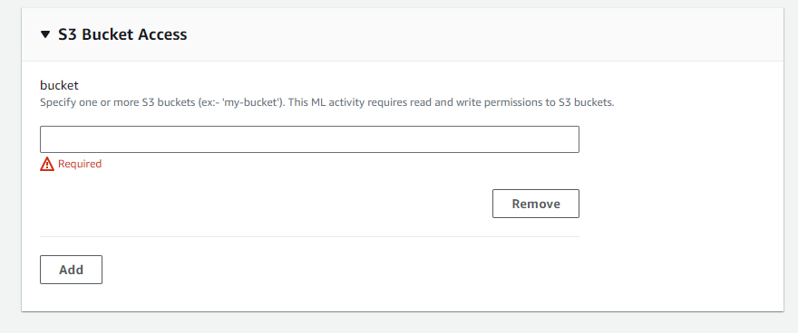
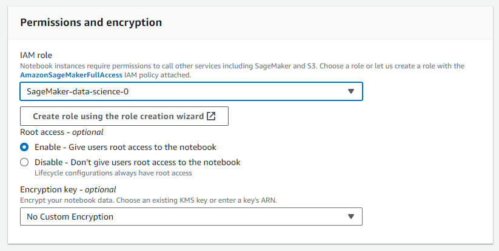

# Ejecutar demostraciones de Teradata Jupyter Notebook para VantageCloud Lake en Amazon SageMaker

## Información general
En este inicio rápido se detalla el proceso para ejecutar las [Demostraciones de Jupyter Notebook de Teradata para VantageCloud Lake](https://github.com/Teradata/lake-demos) en Amazon SageMaker, la plataforma IA/ML de AWS.

## Prerrequisitos
* Módulos de Teradata para Jupyter (descarga [aquí](https://downloads.teradata.com/download/tools/vantage-modules-for-jupyter), es necesario registrarse)
* Cuenta de AWS con acceso a S3 y SageMaker
* [Acceso a un entorno VantageCloud Lake](./getting-started-with-vantagecloud-lake.md)

## Configuración del entorno AWS
En esta sección cubriremos en detalle cada uno de los pasos a continuación:

* Cargar los módulos Teradata para Jupyter en un depósito S3
* Crear un rol de IAM para su instancia de Jupyter notebook
* Crear una configuración de ciclo de vida para su instancia de Jupyter notebook
* Crear una instancia de Jupyter notebook
* Encontrar el CIDR IP de su instancia de Jupyter notebook

### Cargar los módulos Teradata para Jupyter en un depósito S3
* En AWS S3, cree un depósito y tome nota del nombre asignado
* Las opciones predeterminadas son apropiadas para este depósito.
* En el depósito creado, cargue los módulos de Teradata para Jupyter 
        

### Crear un rol de IAM para su instancia de Jupyter Notebooks
* En SageMaker, navegue hasta el administrador de roles 
        
* Crear un nuevo rol (si aún no está definido)
* Para los fines de esta guía, al rol creado se le asigna la persona de científico de datos 
        
* En la configuración, es apropiado mantener los valores predeterminados
* En la pantalla correspondiente, defina el depósito donde cargó los módulos de Teradata Jupyter
        
* En la siguiente configuración agregamos las políticas correspondientes para el acceso al depósito S3  
        

### Crear una configuración de ciclo de vida para su instancia de Jupyter Notebooks
* En SageMaker, navegue hasta configuraciones del ciclo de vida y haga clic en crear 
        
* Defina una configuración de ciclo de vida con los siguientes scripts
        \* Cuando trabaje desde un entorno Windows, recomendamos copiar los scripts en el editor de configuración del ciclo de vida línea por línea. Presione 'Entrar' después de cada línea directamente en el editor para evitar problemas de copia. Este enfoque ayuda a evitar errores de retorno de carro que pueden ocurrir debido a diferencias de codificación entre Windows y Linux. Estos errores a menudo se manifiestan como "/bin/bash^M: bad interpreter" y pueden interrumpir la ejecución del script.
        

    * Al crear un script: 

        ``` bash , id="sagemaker_first_config", role="content-editable emits-gtm-events"
        #!/bin/bash
        
        set -e
        
        # This script installs a custom, persistent installation of conda on the Notebook Instance's EBS volume, and ensures
        # that these custom environments are available as kernels in Jupyter.
        
        
        sudo -u ec2-user -i <<'EOF'
        unset SUDO_UID
        # Install a separate conda installation via Miniconda
        WORKING_DIR=/home/ec2-user/SageMaker/custom-miniconda
        mkdir -p "$WORKING_DIR"
        wget https://repo.anaconda.com/miniconda/Miniconda3-4.6.14-Linux-x86_64.sh -O "$WORKING_DIR/miniconda.sh"
        bash "$WORKING_DIR/miniconda.sh" -b -u -p "$WORKING_DIR/miniconda"
        rm -rf "$WORKING_DIR/miniconda.sh"
        # Create a custom conda environment
        source "$WORKING_DIR/miniconda/bin/activate"
        KERNEL_NAME="teradatasql"
        
        PYTHON="3.8"
        conda create --yes --name "$KERNEL_NAME" python="$PYTHON"
        conda activate "$KERNEL_NAME"
        pip install --quiet ipykernel
        
        EOF
        ```

  * Al iniciar el script (en este script, sustituya el nombre de su depósito y confirme la versión de los módulos de Jupyter)

        ``` bash , role="content-editable emits-gtm-events"
        #!/bin/bash
        
        set -e
        
        # This script installs Teradata Jupyter kernel and extensions.
        
        
        sudo -u ec2-user -i <<'EOF'
        unset SUDO_UID
        
        WORKING_DIR=/home/ec2-user/SageMaker/custom-miniconda
        
        source "$WORKING_DIR/miniconda/bin/activate" teradatasql

        # Install teradatasql, teradataml, and pandas in the teradatasql environment
        pip install teradataml
        pip install pandas

        # fetch Teradata Jupyter extensions package from S3 and unzip it
        mkdir -p "$WORKING_DIR/teradata"
        aws s3 cp s3://resources-jp-extensions/teradatasqllinux_3.4.1-d05242023.zip "$WORKING_DIR/teradata"
        cd "$WORKING_DIR/teradata"
        unzip -o teradatasqllinux_3.4.1-d05242023
        cp teradatakernel /home/ec2-user/anaconda3/condabin
        jupyter kernelspec install --user ./teradatasql
        source /home/ec2-user/anaconda3/bin/activate JupyterSystemEnv

        # Install other Teradata-related packages
        pip install teradata_connection_manager_prebuilt-3.4.1.tar.gz
        pip install teradata_database_explorer_prebuilt-3.4.1.tar.gz
        pip install teradata_preferences_prebuilt-3.4.1.tar.gz
        pip install teradata_resultset_renderer_prebuilt-3.4.1.tar.gz
        pip install teradata_sqlhighlighter_prebuilt-3.4.1.tar.gz

        conda deactivate
        EOF
        ```

### Crear una instancia de Jupyter Notebooks
* En SageMaker, navegue por Notebooks, Instancias de Notebook, cree una instancia de Notebook
* Elija un nombre para su instancia de notebook, defina el tamaño (para demostraciones, la instancia más pequeña disponible es suficiente)
* Haga clic en configuraciones adicionales y asigne la configuración del ciclo de vida creada recientemente 
        
* Haga clic en configuraciones adicionales y asigne la configuración del ciclo de vida creada recientemente
* Asigne el rol de IAM creado recientemente a la instancia del cuaderno 
        

* Pegue el enlace https://github.com/Teradata/lake-demos como repositorio de GitHub predeterminado para la instancia del cuaderno
        

## Encontrar el CIDR IP de su instancia de Jupyter Notebooks
* Una vez que la instancia se esté ejecutando, haga clic en abrir JupyterLab 
        

        

* En JupyterLab, abra un cuaderno con un kernel de Python y ejecute el siguiente comando para encontrar la dirección IP de la instancia del cuaderno.
** Incluiremos esta IP en la lista blanca de su entorno VantageCloud Lake para permitir la conexión.
** Esto es para los fines de esta guía y las demostraciones de cuadernos. Para entornos de producción, es posible que sea necesario configurar e incluir en la lista blanca una configuración de VPC, subredes y grupos de seguridad.

``` python , role="content-editable"
import requests
def get_public_ip():
    try:
        response # requests.get('https://api.ipify.org')
        return response.text
    except requests.RequestException as e:
        return "Error: " + str(e)
my_public_ip = get_public_ip()
print("My Public IP is:", my_public_ip)
```

## Configuración de VantageCloud Lake
* En el entorno VantageCloud Lake, en configuración, agregue la IP de su instancia de notebook
        

## Demostraciones de Jupyter Notebook para VantageCloud Lake

### Configuraciones
* El [archivo vars.json](https://github.com/Teradata/lake-demos/blob/main/vars.json) del archivo debe editarse para que coincida con la configuración de su entorno VantageCloud Lake 
        

* Específicamente se deben agregar los siguientes valores 


        | **Variable** | **Value**|
        |--------------|----------|
        |**"host"**|Public IP value from your VantageCloud Lake environment|
        |**"UES_URI"** |Open Analytics from your VantageCloud Lake environment|
        |**"dbc"**|The master password of your VantageCloud Lake environment|


    :::info
    Remember to change all passwords in the vars.json file.
    :::

* Verá que en el archivo vars.json de muestra, las contraseñas de todos los usuarios están predeterminadas en "password", esto es solo para fines ilustrativos, debe cambiar todos estos campos de contraseña a contraseñas seguras, protegerlas según sea necesario y seguir otras prácticas recomendadas de gestión de contraseñas.

## Ejecutar demostraciones
Abra y ejecute todas las celdas de **0_Configuración del entorno de demostración.ipynb** para configurar su entorno. Seguido de **1_Configuración de demostración de datos base.ipynb** para cargar los datos base necesarios para las demostracion.

Para obtener más información sobre los cuadernos de demostración, vaya a la página [Demostraciones de Teradata Lake](https://github.com/Teradata/lake-demos) en GitHub.

## Resumen

En este inicio rápido, aprendimos cómo ejecutar demostraciones de Jupyter notebooks para VantageCloud Lake en Amazon SageMaker.

## Lectura adicional

* [Documentación de Teradata VantageCloud Lake](https://docs.teradata.com/r/Teradata-VantageCloud-Lake/Getting-Started-First-Sign-On-by-Organization-Admin)
* [Utilizar Vantage desde un Jupyter Notebook](../analyze-data/jupyter.md)