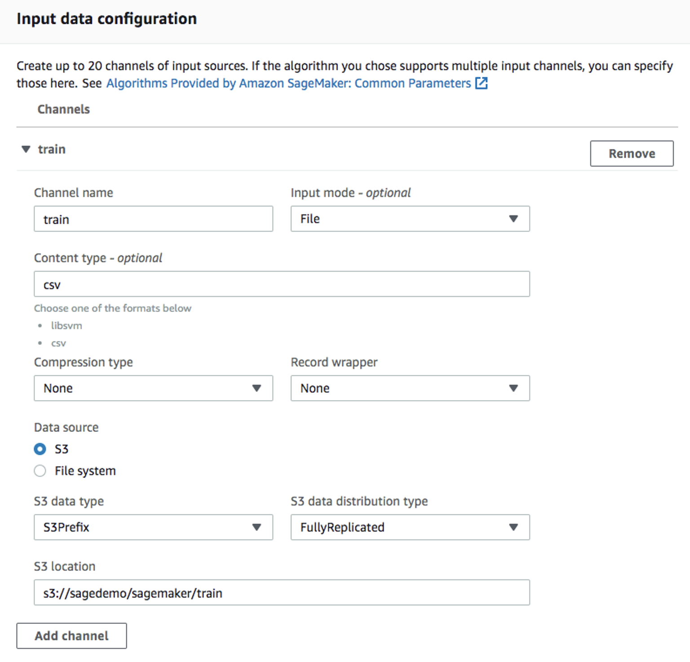
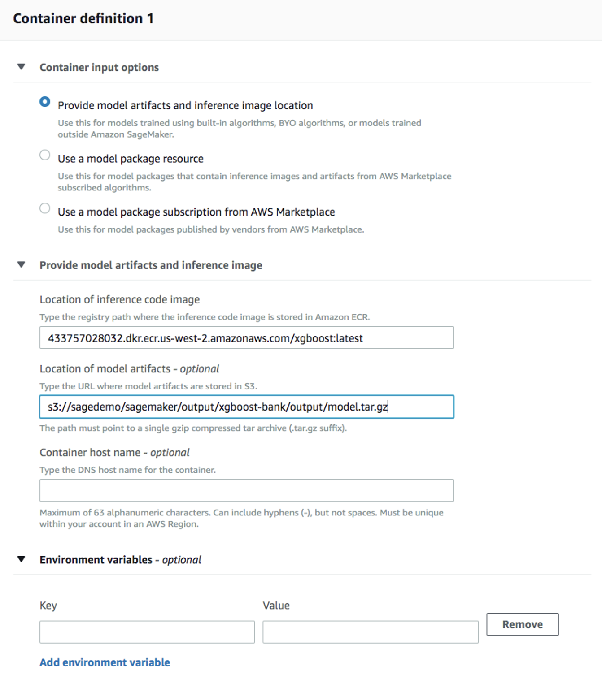

import CommunityLinkPartial from '../_partials/community_link.mdx';

# VantageからSageMakerのAPIを実行する方法


### 概要

このハウツーは、Amazon SageMaker と Teradata Vantage を統合するのに役立ちます。このガイドで説明するアプローチは、サービスと統合するための多くの潜在的なアプローチの 1 つです。

Amazon SageMaker は、完全に管理された機械学習プラットフォームを提供します。Amazon SageMaker と Teradata には 2 つの使用例があります。

1\. データは Teradata Vantage 上に存在し、Amazon SageMaker はモデル定義とその後のスコアリングの両方に使用されます。このユースケースでは、Teradata は Amazon S3 環境にデータを提供し、Amazon SageMaker がモデル開発の目的でトレーニングおよびテストデータセットを使用できるようにします。さらに、Teradata は Amazon S3 経由でデータを利用できるようにします。このデータは、Amazon SageMaker によるその後のスコアリングに使用されます。このモデルでは、Teradata はデータリポジトリのみです。

2\. データは Teradata Vantage 上に存在し、Amazon SageMaker はモデル定義に使用され、Teradata はその後のスコアリングに使用されます。このユースケースでは、Teradata は Amazon S3 環境にデータを提供し、Amazon SageMaker はモデル開発の目的でトレーニングおよびテストデータセットを利用できるようになります。Teradata は、その後の Teradata Vantage によるスコアリングのために、Amazon SageMaker モデルを Teradata テーブルにインポートする必要があります。このモデルでは、Teradata はデータリポジトリおよびスコアリングエンジンです。

このドキュメントでは、最初のユースケースについて説明します。

Amazon SageMaker は、Amazon S3 バケットからトレーニング データとテスト データを使用します。この記事では、Teradata 分析データセットを Amazon S3 バケットにロードする方法について説明します。その後、Amazon SageMaker でデータを使用して機械学習モデルを構築およびトレーニングし、実稼働環境にデプロイすることができます。


### 前提条件

import ClearscapeDocsNote from '../_partials/vantage_clearscape_analytics.mdx'

* Teradata Vantageインスタンスへのアクセス。
  <ClearscapeDocsNote />
* Amazon S3 バケットにアクセスし、Amazon SageMaker サービスを使用するための IAM 権限。
* トレーニングデータを保存するための Amazon S3 バケット。

### データのロード

Amazon SageMaker は、Amazon S3 バケットからデータをトレーニングします。Vantage から Amazon S3 バケットにトレーニング データをロードする手順は次のとおりです。

1\. Amazon SageMaker コンソールにアクセスし、ノートブックインスタンスを作成します。ノートブックインスタンスの作成方法については、 [Amazon SageMaker 開発者ガイド](https://docs.aws.amazon.com/sagemaker/latest/dg/gs-setup-working-env.html) を参照してください:

Notebookのインスタンスを開きます。


3. `New -> conda_python3` をクリックして新規ファイルを起動します。


4. Teradata Pythonライブラリをインストールします。
    ``` python
    !pip install teradataml
    ```

5. 新しいセルに追加のライブラリをインポートします。
    ``` python
    import teradataml as tdml
    from teradataml import create_context, get_context, remove_context
    from teradataml.dataframe.dataframe import DataFrame
    import pandas as pd
    import boto3, os
    ```

6. 新しいセルで、Teradata Vantage に接続します。 `<hostname>`、 `<database user name>`、 `<database password>` を Vantage 環境に合わせて置き換えます。
    ``` python
    create_context(host = '<hostname>', username = '<database user name>', password = '<database password>')
    ```

7. TeradataML DataFrame APIを使用して学習用データセットが存在するテーブルからデータを取得します。
    ``` python
    train_data = tdml.DataFrame('table_with_training_data')
    trainDF = train_data.to_pandas()
    ```

8. ローカルファイルにデータを書き込みます。
    ``` python
    trainFileName = 'train.csv'
    trainDF.to_csv(trainFileName, header=None, index=False)
    ```

9. Amazon S3にファイルをアップロードします。
    ``` python , id="sagemaker_first_usage", role="content-editable emits-gtm-events
    bucket = 'sagedemo'
    prefix = 'sagemaker/train'

    trainFile = open(trainFileName, 'rb')
    boto3.Session().resource('s3').Bucket(bucket).Object(os.path.join(prefix, localFile)).upload_fileobj(trainFile)
    ```

### モデルの学習

1. 左メニューの `Training` の下にある `Training jobs` を選択し、 `Create training job` をクリックします。


2.  `Create training job` ウィンドウで、IAM ロールの `Job name` (例: `xgboost-bank`) と `Create a new role` を入力します。Amazon S3 バケットの `Any S3 bucket` と [ `Create role`を選択します。


3. `Create training job` ウィンドウに戻りアルゴリズムとして `XGBoost` を使用します。


4. デフォルトの `ml.m4.xlarge` インスタンス タイプと、インスタンスごとに 30 GB の追加ストレージ ボリュームを使用します。これは短いトレーニング ジョブであり、10 分以上かかることはありません。


5. 以下のハイパーパラメータを入力しそれ以外はデフォルトのままにしてください。
    ```bash
    num_round=100
    silent=0
    eta=0.2
    gamma=4
    max_depth=5
    min_child_weight=6
    subsample=0.8
    objective='binary:logistic'
    ```

6.  `Input data configuration`には、トレーニングデータを保存した Amazon S3 バケットを入力します。入力モードは `File`です。コンテンツタイプは `csv`です。 `S3 location` は、ファイルがアップロードされた場所です。


7. `Output data configuration` には出力データを保存するパスを入力します。


8. その他はすべてデフォルトのままにして、「トレーニングジョブの作成」をクリックします。トレーニングジョブの設定方法の詳細な手順については、[Amazon SageMaker 開発者ガイド](https://docs.aws.amazon.com/sagemaker/latest/dg/sagemaker-mkt-algo-train.html#sagemaker-mkt-algo-train-console] を参照してください。

トレーニングジョブが作成されるとAmazon SageMakerはMLインスタンスを起動してモデルをトレーニングし、結果のモデル成果物やその他の出力を`Output data configuration`デフォルトでは`path/<training job name>/output`）に格納します。

### モデルのデプロイ

モデルを学習させた後、永続的なエンドポイントを使用してモデルをデプロイします。

### モデルの作成

1. 左パネルから [ `Inference` の下の `Models` を選択し、次に `Create model`を選択します。モデル名 (例: `xgboost-bank`) を入力し、前の手順で作成した IAM ロールを選択します。
2\. `Container definition 1`には `433757028032.dkr.ecr.us-west-2.amazonaws.com/xgboost:latest` を `Location of inference code image`として使用します。 `Location of model artifacts` はトレーニングジョブの出力パスです。

3. 他はデフォルトのまま `Create model` します。

### エンドポイントコンフィギュレーションの作成

1. 作成したモデルを選択し、 `Create endpoint configuration` をクリックします。


2. 名前（例： `xgboost-bank`）を入力し、その他はすべてデフォルトを使用します。モデル名とトレーニングジョブは自動的に入力されます。 `Create endpoint configuration`をクリックします。

### エンドポイントを作成

1. 左パネルから `Inference` -> `Models` を選択し、再度モデルを選択し、今度は `Create endpoint` をクリックします。


2. 名前 (例: `xgboost-bank`)を入力し、`Use an existing endpoint configuration`を選択します。


3. 前回の手順で作成したエンドポイント構成を選択し `Select endpoint configuration` をクリックします。


4. 他のすべてをデフォルトのままにして `Create endpoint` をクリックします。

これでモデルがエンドポイントにデプロイされクライアントアプリケーションから利用できるようになります。

### まとめ

このハウツーでは、Vantage からトレーニング データを抽出し、それを使用して Amazon SageMaker でモデルをトレーニングする方法を示しました。このソリューションでは、Jupyter ノートブックを使用して Vantage からデータを抽出し、それを S3 バケットに書き込みました。SageMaker トレーニング ジョブは S3 バケットからデータを読み取り、モデルを作成しました。モデルはサービス エンドポイントとして AWS にデプロイされました。

### さらに詳しく
* [AWS SageMaker の API 統合ガイド](https://docs.teradata.com/r/Enterprise_IntelliFlex_VMware/Teradata-VantageTM-API-Integration-Guide-for-Cloud-Machine-Learning/Amazon-Web-Services)
* [Teradata Jupyter Extentionsと SageMakerNotebookインスタンスを統合する](../analyze-data/integrate-teradata-jupyter-extensions-with-sagemaker.md)


<CommunityLinkPartial />

