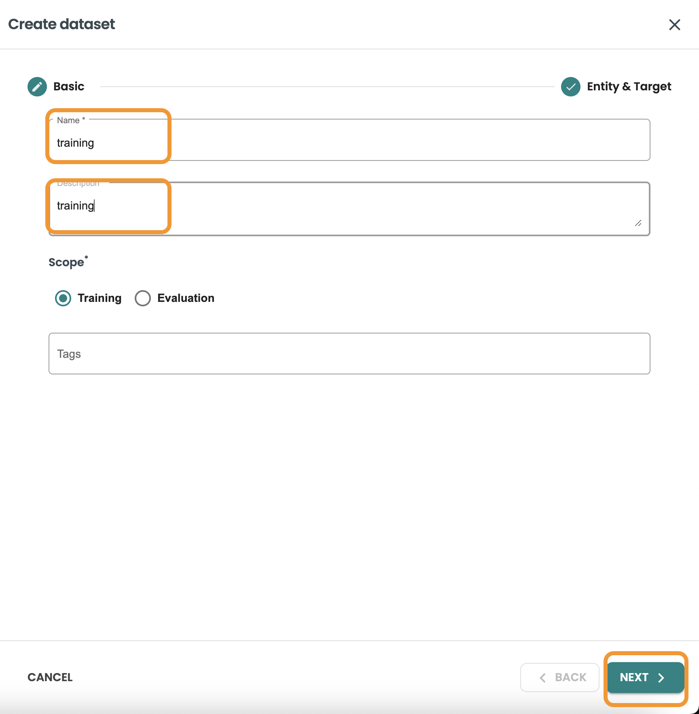
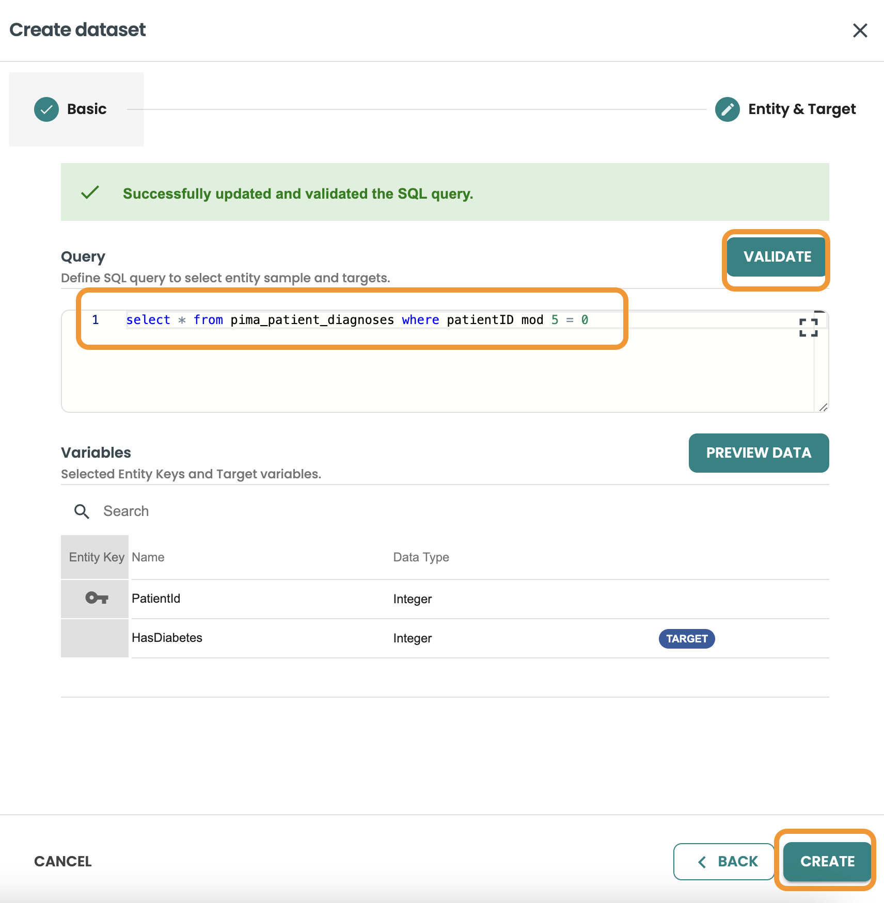
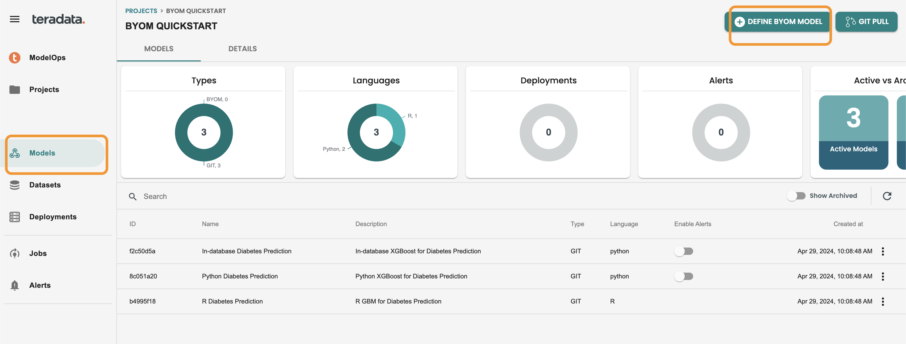
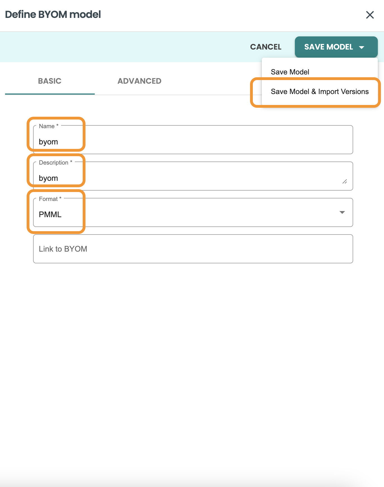
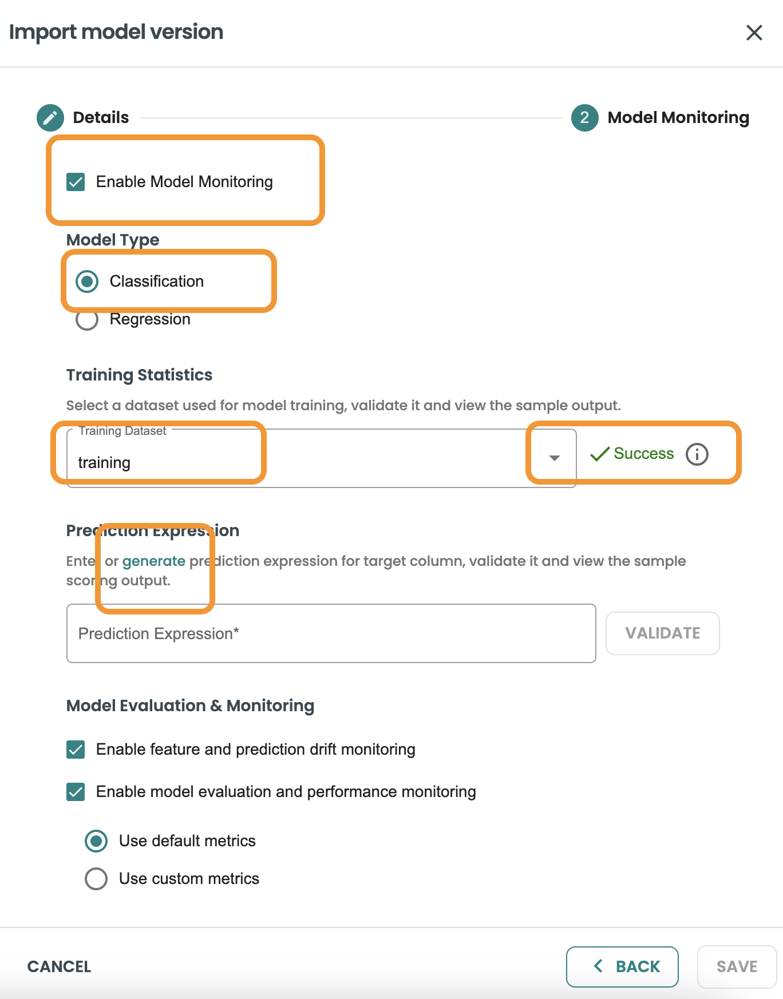
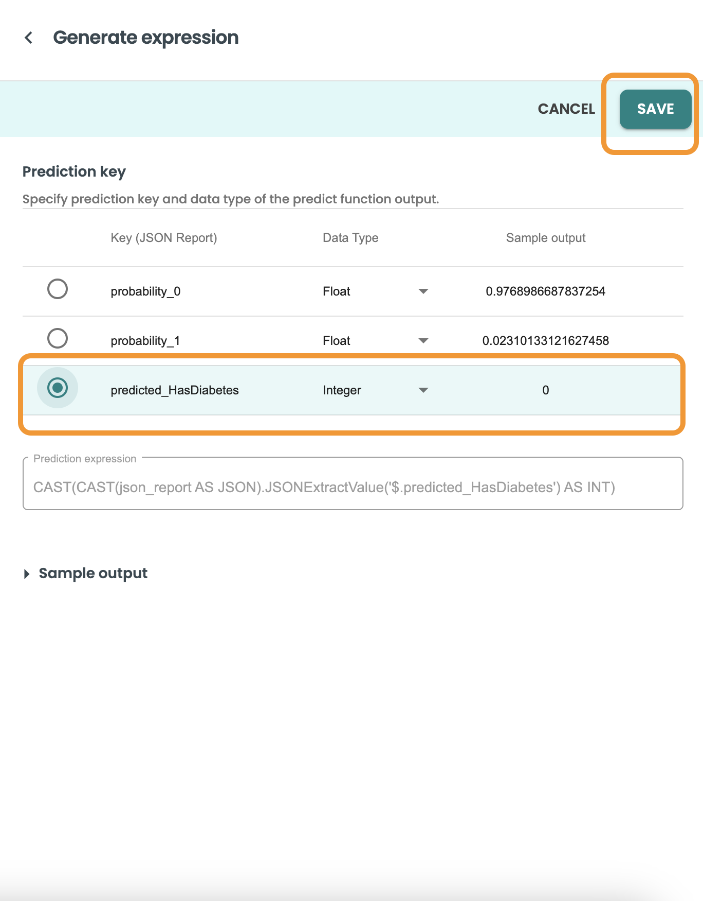
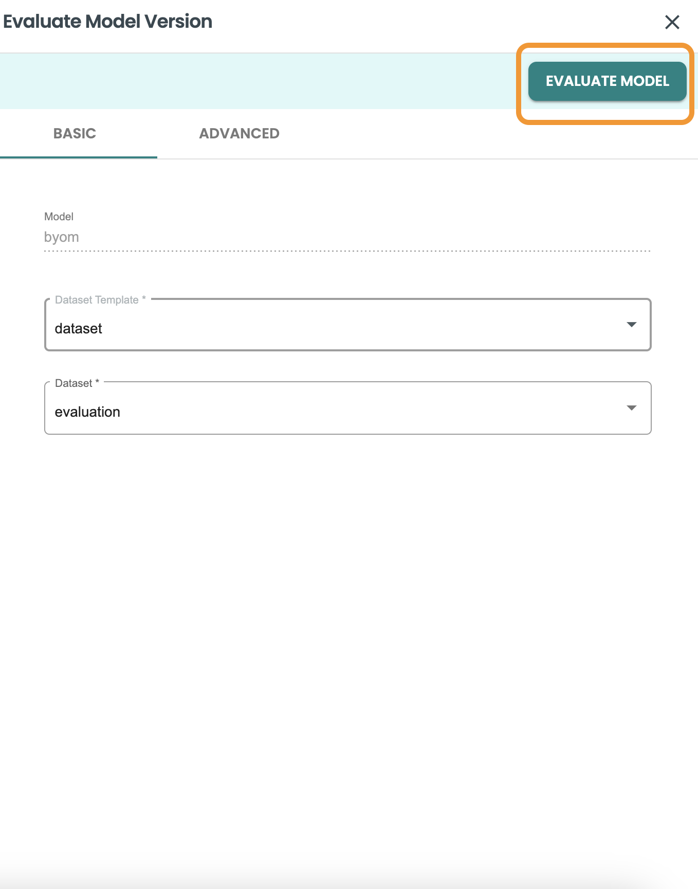
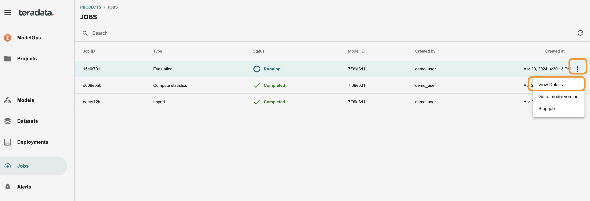
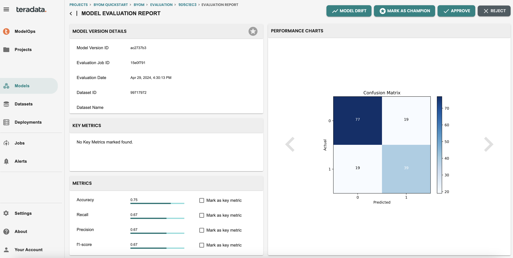
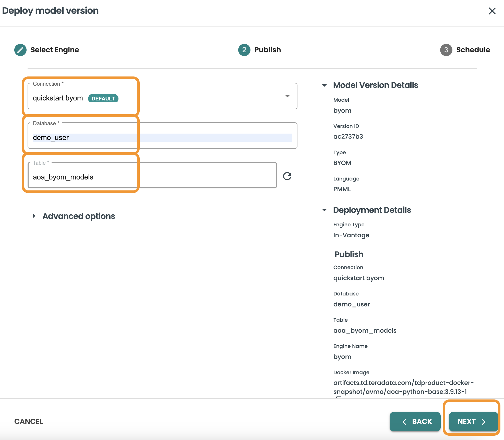

import ClearscapeDocsNote from '../_partials/vantage_clearscape_analytics.mdx'

# ModelOps - Import and Deploy your first BYOM Model

## Overview

This tutorial helps you to get started quickly using ClearScape Analytics ModelOps. We discuss key concepts briefly, so you can get right down to importing your first Bring-your-own-model (BYOM) models into ModelOps. In other tutorials in this quickstart site, you will have the opportunity to go deeper into other deployment and automation patterns with ClearSCape Analytics ModelOps.

In this tutorial, you will learn:

* What’s the difference between BYOM functions and ModelOps BYOM

* Importing your first BYOM model in the Model Registry through the graphical user interface

* Deploying the model in Vantage with automated scheduling and monitoring capabilities

## Prerequisites

We provide an associated notebook and sample data that you can import into your clearscape environment to access and run all of the code examples included in the quickstart. [Download the ModelOps sample notebooks and data](../modelops/attachments/ModelOps_Quickstart_BYOM.zip)

* Access to a Teradata Vantage instance with ClearScape Analytics (includes ModelOps)

* Access to a Jupyter notebook environment or use the one available in ClearScape Analytics Experience:


<ClearscapeDocsNote />


## Key concepts you should know about first

### Bring your own model (BYOM) in Teradata Vantage

The Vantage Bring Your Own Model (BYOM) package gives data scientists and analysts the ability to operationalize predictive models in Vantage. Predictive models trained in external tools can be used to score data stored in Vantage using the BYOM Predict functions. 

Create or convert your predictive model using a supported model interchange format (PMML, MOJO, ONNX, Dataiku, and DataRobot are currently available), import it in a Vantage table, and use the BYOM PMMLPredict, H2OPredict, ONNXPredict, DataikuPredict, or DataRobotPredict to score your data with the model.

### Bring your own model (BYOM) in Teradata Vantage with ModelOps

In ModelOps the BYOM package is enriched with additional governance, automation, and monitoring capabilities for data scientists and machine learning engineers with the possibility of applying all of this without coding. In addition to the compatible formats of BYOM package, ModelOps extends the possibility to import and score models inside Vantage to Python scripts, R scripts and SAS scoring accelerator models. 
Once you have your compatible model created or converted using a supported format (PMML, MOJO, ONNX, Dataiku, DataRobot, Python script, R script and SAS scoring accelerator model) then you can either use the ModelOps graphical user interface or the ModelOps code SDK to import into the model registry. 

### Understand where we will focus at the ModelOps methodology
In this tutorial, we will show you the end-to-end of this process using the associated Notebook and the ModelOps graphical user interface. 


## Steps in this Guide

1. Create a project and connection (ModelOps)
2. Environment Setup (Notebook)
3. Creating datasets (ModelOps)
4. Train a model and export to PMML (Notebook)
5. Import the PMML into Vantage using BYOM functions (Notebook)
6. Import the PMML into Vantage using ModelOps Graphical user interface (ModelOps)
7. Go through Automated Lifecycle - Evaluation, Approve, Deploy (ModelOps)
8. Default and Custom alerting rules for Monitoring (ModelOps)
9. Custom Evaluation metrics and charts (Notebook)

## 1. Create a project

Login into ModelOps and navigate to the Projects screen.

Click on the CREATE PROJECT button located on the top-right of the screen. We're using an cloned demo code in ModelOps with this path: /app/built-in/demo-models as git repository. Here we recommend you clone into your git repository instance the demo models public git: https://github.com/Teradata/modelops-demo-models.git in the branch "tmo"


Inside the Project creation sheet panel, include the following values:

* Name: "BYOM Quickstart"

* Description: "BYOM Quickstart"

* Group: DEMO

* Path: /app/built-in/demo-models

* Credentials: No Credentials

* Branch: tmo

Click the TEST GIT CONNECTION button. If the test is succesful then click on save and continue.


## Create a Personal Connection

In this guide we will skip creating a service connection, so click SAVE & CONTINUE and then NEXT to create a personal connection. 


Inside the Personal Connection of the Projects creation sheet panel, include the following values:

* Name: Quickstart Personal

* Description: Quickstart Personal Connection

* Host: ClearScape-url

* Database: "demo_user"

* VAL Database Name: "VAL"

* BYOM Database Name: "MLDB"

* Login Mechanism: "TDNEGO"

* Username: demo_user

* Pasword: your-password

Test the Vantage connection by clicking on the TEST CONNECTION button.

Click save.


This is how the Projects panel will show with the new project created:


## Connection Healthcheck panel

Enter into the project by clicking on it, and get inside Settings on the Left-hand menu. Use View details from your connection


Then you should get the healthcheck panel, where it will show if SQLE, BYOM and VAL associated rights are enabled for this connection user. If there is any error here, contact your dba to apply the specific rights. Review the onboarding bteq script that comes in the attached files of the quickstart for the specific GRANT commands that are required.


## 2. Environment Setup (Notebook)

Follow the Notebook attached in this quickstart to perform the envrionnment setup and checks at the database level.

## 3. Creating datasets (ModelOps)

Click on your newly created project and then click on the Datasets button located on the left-hand menu. Click on CREATE DATASET TEMPLATE.


Enter the following values:

* Name: dataset

* Description: dataset

* Feature Catalog: Vantage

* Database: your-db

* Table: aoa_statistics_metadata


Click next and enter the Features Query: This query will be used to identify the features table, you can also Validate statistics and preview Data:

``` sql
SELECT * FROM pima_patient_features
```


Continue to Entity & Target and include the query: This query will be used to join with the features based on the same entity and to filter the rows of the Training, Evaluation and Scoring Datasets.

You need to select HasDiabetes as the target variable from this query, then Validate Statistics

``` sql
SELECT * FROM pima_patient_diagnoses
```


Continue to Predictions and include the details of the database, table, and the query: This query will be used as the Input of the execution of your model in Production when this model will be deployed as BATCH (Note: BYOM models can only be deployed as batch in ModelOps version 7)

* Database: your-db

* Table: pima_patient_predictions

* Query:

``` sql
SELECT * FROM pima_patient_features WHERE patientid MOD 5 = 0
```


### Create Training dataset

Click on create dataset, Enter the name and description and Select training and click next.

This query we want to filter and get 80% of rows of the dataset, we use `MOD 5 <> 0` to get this:

``` sql
SELECT * FROM pima_patient_diagnoses WHERE patientid MOD 5 <> 0
```




Confirm the query and click on create.

### Create Evaluation dataset

Click on create dataset, Enter the name and description and Select evaluation and click next.

This query we want to filter and get 20% of rows of the dataset, we use MOD 5 = 0 to get this:

``` sql
SELECT * FROM pima_patient_diagnoses WHERE patientid MOD 5 = 0
```





Confirm the query and click on create.

This is how it should show both datasets for Training and Evaluation


## 4. Train a model and export to PMML (Notebook)

Follow the Notebook attached in this quickstart to perform the model training, conversion and download the model pmml file for following steps.

## 5. Import the PMML into Vantage using BYOM functions (Notebook)

Follow the Notebook attached in this quickstart to use and understand the BYOM package functions, this way will publish the models in Vantage, but not in the ModelOps registry and we will not have governance, automation or monitoring capabilities.

## 6. Import the PMML into Vantage using ModelOps Graphical user interface (ModelOps)

### Import into ModelOps 

Go to Models at the left-hand menu and click on DEFINE BYOM MODEL



Fill the fields with this values as example:

* Name: byom

* Description: byom

* Format: PMML

Click on Save Model & Import versions



Fill the field for external id to track it from the training tool, and upload the model.pmml file - NOTE It has to be this exact name: model.pmml

* External id: 001

* model file: model.pmml


### Enable default automated Evaluation and Monitoring 

In this screen we are going to keep marked the Enable Monitoring capabily. 

We need to select the training dataset that was used for this model pmml when training. We have already created this dataset before, so we select

Then we press on VALIDATE. 

BYOM predict functions generate an output based on a JSON, and this is different for every BYOM model. We need to know the specific field that is the target/output of our prediction. In order to use it in our evaluation logic and generate model metrics (accuracy, precision, etc.). For this we require a CAST expression on the JSON output file.

We have included a Generate Link to help us on validating and implementing this CAST expression. So click on the Generate button to move into the helper screen and get the expression



Now select the target/output variable of our prediction. In this demo case is: predicted_HasDiabetes.

Click on Save and let the helper copy the expression for you. 

, width=50%]

This is the CAST expression, Click on Save on the dialog:
CAST(CAST(json_report AS JSON).JSONExtractValue('$.predicted_HasDiabetes') AS INT)


Now you can validate the Cast Expression and click on Save:


A new job for MODEL IMPORT and another job for COMPUTE STATISTICS will run for few minutes. 


## 7. Go through Automated Lifecycle - Evaluation, Approve, Deploy (ModelOps)

### Evaluate the model version in ModelOps

After finishing the jobs a new model version will be available in the Model version catalog of this byom model like the following image. Click on the model version to get inside Lifecycle:


The model is in IMPORT stage. we can now evaluate the model, click EVALUATE to run the automated default evaluation job


Select the evaluation dataset and click on EVALUATE MODEL. 



This will create a new Job for the Evaluation and will show the log. These screen can be closed at the X button at the top-right.


You can access at any time at the left-hand menu JOBS screen. to go again into the log you just need to click on the 3 dots of the job and VIEW DETAILS. This is how it should look:



Once the job is finished, model will be in the EVALUATE stage in the lifecycle screen. Go to your model version to see it.

You can check all the details of the evaluation step, including an evaluation REPORT, where you will see metrics and Charts that the default Evaluation logic has generated. NOTE: These metrics are default for Classification and Regression models and can be customized with a coded template that will share later in the quickstart.




### Approve the model version

Once the model version is evaluated, it is ready to be approved or rejected. This approval can be done through model lifecycle screen, in the model report screen and it can also be done through REST API integrating an external tool like Jira/BPM case management systems.

Let's get into the Approval dialog and include the following description, as an example: 

* Approval comment: Go for Production


### Deploy the model version and schedule scoring

to deploy the model you need to use the DEPLOY button in the model lifecycle screen.


For BYOM models the deployment target available is In-Vantage, as we want to leverage the BYOM predict functions in Vantage:


Publish the model: Select the connection to Vantage that will be used to publish the model, the database and the table. Here we will use our created connection and the table we created for storing BYOM models: aoa_byom_models. Click Next after including these details

* Connection: personal

* Database: demo_user

* Table: aoa_byom_models



Now in the Scheduling step, you are able to enable scheduling and select what is the frequency/cadence of this scoring. Keep marked the Enable Scheduling checkbox and select "Manual" in this demo, inside clearscape.teradata.com in order to save resources the scheduling options are disabled. Any scheduling option is available since we can include a CRON expression.

In this screen we will also select the dataset template to be used when scoring the model in production. The Prediction details of the dataset will be used such as the Input query, and output prediction table that we defined in the Datasets step.

Click on Deploy to finalize this step


A new Deployment job will be running by the ModelOps Agent. once this is finished a new deployment will be available in the Deployments section of the left-hand menu.


### Deployment details including history of jobs, feature/prediction drift and performance monitoring

Go to the left-hand menu Deployments, and see the new deployment from the BYOM model is available, click on it to see the details and go to the Jobs tab

, width=50%]

In the Jobs tab you will see the history of executions of this model deployed. Let's run now a new scoring using the Run now button. This button can be also scheduled externally through REST APIs


After executing the scoring job, it should look like this:


And we can get into the output details of this job, by clicking on the three dots at the right, and view predictions


Now that we have run a job in production, the default Monitoring capabilities are enabled, you can check both feature and prediction drift to see individually per feature the histogram calculation and the Population Stability Index (PSI) KPI for drift monitoring


In the Performance metrics tab, we see that there is only a single metric data point, this is because performance monitoring relies on Evaluation jobs. So let's create a new dataset and run a new evaluation at this deployment to simulate we have new fresh data and want to check on the performance of my model by comparing the metrics with the previous evaluation.

### Performance monitoring with new dataset

Let's create a new evaluation dataset in Datasets left-hand menu.

We will use the same dataset template that we created and will create a new dataset with the following details

* Name: evaluation2

* Description: evaluation2

* Scope: evaluation


And let's simulate the new evaluation with a new dataset query

``` sql
SELECT * FROM pima_patient_features WHERE patientid MOD 10 = 0
```

And click on create to generate new dataset for evaluation


Now you can go back to your deployment to evaluate the model version deployed:


Use the new dataset created in the Evaluation job panel:

* Dataset template: dataset

* Dataset: evaluate2

and click on EVALUATE model


Once the Evaluation job is finished, then the performance metrics will show a new set of metrics with the new dataset used:


## 8. Default and Custom alerting rules for Monitoring (ModelOps)

### Enabling alerting

Default Alerts in ModelOps are activated at the models screen, There is a Enable Alerts column in this table, activate it to start with default alerting


Once this alerts are enabled you can check on the definition of the default alert, by getting inside the model and getting into the ALERT tab:


### Updating alerting rules

We can create new alerts, like new rules for performance monitoring or update default alerting rules. 

Let's do an alert edit, on the feature drift monitoring. click on the alert edit


Here you can update the fields. Let's update the value treshold from 0.2 to 0.18 and click on UPDATE


After editing the rule, your alerts screen should look like this:


### Reviewing alerts

Now that we have alert edited, we should wait 1 minute till we get a new alert into the ModelOps tool. This alert can be configured to send an email to a set of email addresses as well.

Now we have received the alert, we can see a red circle in the alerts at the left-hand menu

We can directly access to the model version from this screen by clicking on the modelid


Once we are in the model lifecycle screen, we see a direct access to Model Drift, let's get inside


Then we can see the individual features in red in the feature drift tab of my deployed model. This alert is indicating that the latest scoring data is drifted from the training data with that value of population stability index(PSI). And teams can then make proactive actions to evaluate the drift of the model and replace the model in production if is needed


## 9. Custom Evaluation metrics and charts (Notebook)

Follow the Notebook attached in this quickstart to understand the methodology for creating custom Evaluation logic, metrics and charts

## Summary

In this quick start we have learned what is the difference between BYOM functions and ModelOps BYOM pattern, How to import models with ModelOps graphical user interface, and how to automate the scoring and monitoring of the model getting Data Drift and Model QUality metrics alerts

## Further reading

[ClearScape Analytics ModelOps User Guide](https://docs.teradata.com/search/documents?query=ModelOps&sort=last_update&virtual-field=title_only&content-lang=)

import CommunityLinkPartial from '../_partials/community_link.mdx';

<CommunityLinkPartial />
