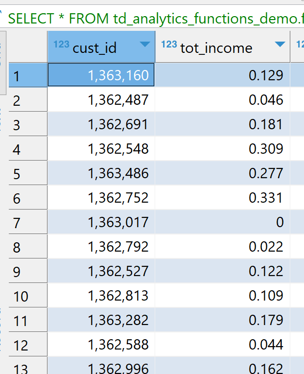
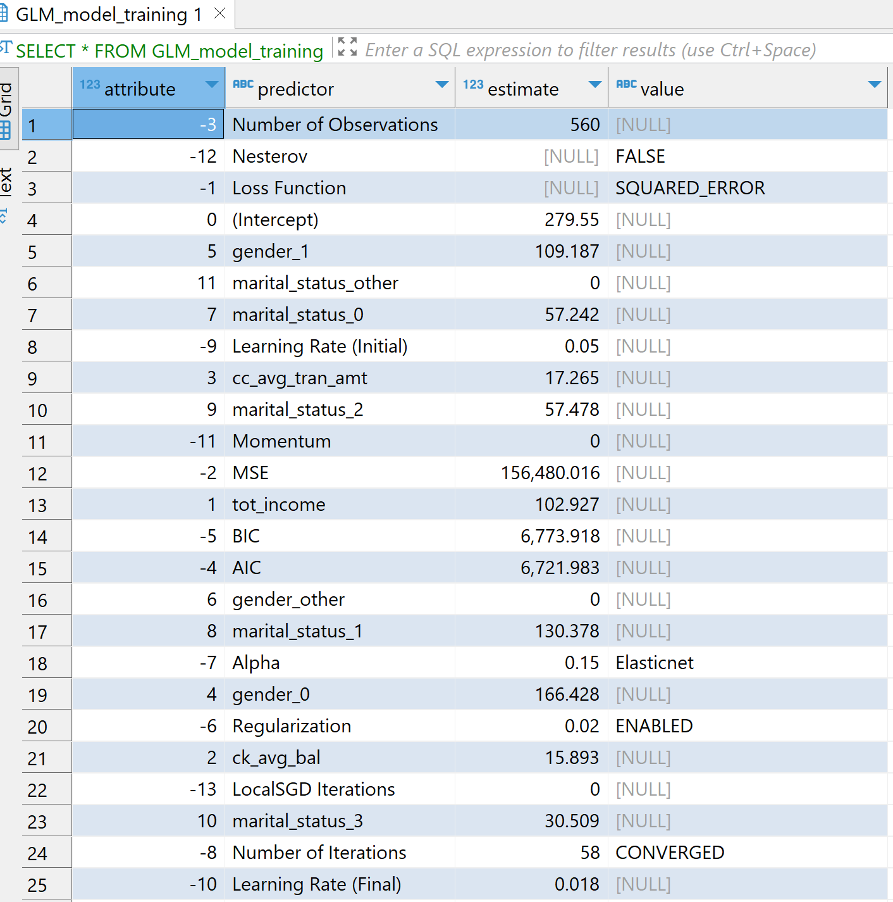

import ClearscapeDocsNote from '../_partials/vantage_clearscape_analytics.mdx'
import CommunityLink from '../_partials/community_link.mdx'

# Train ML models in Vantage using Database Analytic Functions

## Overview

There are situations when you want to quickly validate a machine learning model idea. You have a model type in mind. You don't want to operationalize with an ML pipeline just yet. You just want to test out if the relationship you had in mind exists. Also, sometimes even your production deployment doesn't require constant relearning with MLops. In such cases, you can use Database Analytic Functions for feature engineering, train different ML models, score your models, and evaluate your model on different model evaluation functions.

## Prerequisites

You need access to a Teradata Vantage instance.
<ClearscapeDocsNote />

## Load the sample data

Here in this example we will be using the sample data from `val` database. We will use the `accounts`, `customer`, and `transactions` tables. We will be creating some tables in the process and you might face some issues while creating tables in `val` database, so let's create our own database `td_analytics_functions_demo`.

```
CREATE DATABASE td_analytics_functions_demo
AS PERMANENT = 110e6;
```

:::note
You must have CREATE TABLE permissions on the Database where you want to use Database Analytics Functions.
:::

Let's now create `accounts`, `customer` and `transactions` tables in our database `td_analytics_functions_demo` from the corresponding tables in `val` database.

```
DATABASE td_analytics_functions_demo;

CREATE TABLE customer AS (
SELECT * FROM val.customer
) WITH DATA;

CREATE TABLE accounts AS (
SELECT * FROM val.accounts
) WITH DATA;

CREATE TABLE transactions AS (
SELECT * FROM val.transactions
) WITH DATA;
```

## Understand the sample data

Now, that we have our sample tables loaded into `td_analytics_functions_demo`, let's explore the data. It's a simplistic, fictitious dataset of banking customers (700-ish rows), Accounts (1400-ish rows) and Transactions (77K-ish rows). They are related to each other in the following ways:


In later parts of this how-to we are going to explore if we can build a model that predicts average monthly balance that a banking customer has on their credit card based on all non-credit card related variables in the tables.

## Preparing the Dataset
 
We have data in three different tables that we want to join and create features. Let's start by creating a joined table. 

```
-- Create a consolidated joined_table from customer, accounts and transactions table
CREATE TABLE td_analytics_functions_demo.joined_table AS (
    SELECT
        T1.cust_id  AS cust_id
       ,MIN(T1.income) AS tot_income
       ,MIN(T1.age) AS tot_age
       ,MIN(T1.years_with_bank) AS tot_cust_years
       ,MIN(T1.nbr_children) AS tot_children
       ,MIN(T1.marital_status)AS marital_status
       ,MIN(T1.gender) AS gender
       ,MAX(T1.state_code) AS state_code
       ,AVG(CASE WHEN T2.acct_type = 'CK' THEN T2.starting_balance+T2.ending_balance ELSE 0 END) AS ck_avg_bal
       ,AVG(CASE WHEN T2.acct_type = 'SV' THEN T2.starting_balance+T2.ending_balance ELSE 0 END) AS sv_avg_bal
       ,AVG(CASE WHEN T2.acct_type = 'CC' THEN T2.starting_balance+T2.ending_balance ELSE 0 END) AS cc_avg_bal
       ,AVG(CASE WHEN T2.acct_type = 'CK' THEN T3.principal_amt+T3.interest_amt ELSE 0 END) AS ck_avg_tran_amt
       ,AVG(CASE WHEN T2.acct_type = 'SV' THEN T3.principal_amt+T3.interest_amt ELSE 0 END) AS sv_avg_tran_amt
       ,AVG(CASE WHEN T2.acct_type = 'CC' THEN T3.principal_amt+T3.interest_amt ELSE 0 END) AS cc_avg_tran_amt
       ,COUNT(CASE WHEN ((EXTRACT(MONTH FROM T3.tran_date) + 2) / 3) = 1 THEN T3.tran_id ELSE NULL END) AS q1_trans_cnt
       ,COUNT(CASE WHEN ((EXTRACT(MONTH FROM T3.tran_date) + 2) / 3) = 2 THEN T3.tran_id ELSE NULL END) AS q2_trans_cnt
       ,COUNT(CASE WHEN ((EXTRACT(MONTH FROM T3.tran_date) + 2) / 3) = 3 THEN T3.tran_id ELSE NULL END) AS q3_trans_cnt
       ,COUNT(CASE WHEN ((EXTRACT(MONTH FROM T3.tran_date) + 2) / 3) = 4 THEN T3.tran_id ELSE NULL END) AS q4_trans_cnt
    FROM Customer AS T1
        LEFT OUTER JOIN Accounts AS T2
            ON T1.cust_id = T2.cust_id
        LEFT OUTER JOIN Transactions AS T3
            ON T2.acct_nbr = T3.acct_nbr
GROUP BY T1.cust_id) WITH DATA UNIQUE PRIMARY INDEX (cust_id);
```

Let's now see how our data looks. The dataset has both categorical and continuous features or independent variables. In our case, the dependent variable is `cc_avg_bal` which is customer's average credit card balance.


## Feature Engineering

On looking at the data we see that there are several features that we can take into consideration for predicting the `cc_avg_bal`.

### TD_OneHotEncodingFit

As we have some categorical features in our dataset such as `gender`, `marital status` and `state code`. We will leverage the Database Analytics function [TD_OneHotEncodingFit](https://docs.teradata.com/r/Enterprise_IntelliFlex_VMware/Database-Analytic-Functions/Feature-Engineering-Transform-Functions/TD_OneHotEncodingFit) to encode categories to one-hot numeric vectors. 

```
CREATE VIEW td_analytics_functions_demo.one_hot_encoding_joined_table_input AS (
  SELECT * FROM TD_OneHotEncodingFit(
    ON td_analytics_functions_demo.joined_table AS InputTable
    USING
    IsInputDense ('true')
    TargetColumn ('gender','marital_status','state_code')
    CategoryCounts(2,4,33)
Approach('Auto')
) AS dt
);
```

### TD_ScaleFit

If we look at the data, some columns like `tot_income`, `tot_age`, `ck_avg_bal` have values in different ranges. For the optimization algorithms like gradient descent it is important to normalize the values to the same scale for faster convergence, scale consistency and enhanced model performance. We will leverage [TD_ScaleFit](https://docs.teradata.com/r/Enterprise_IntelliFlex_VMware/Database-Analytic-Functions/Feature-Engineering-Transform-Functions/TD_ScaleFit) function to normalize values in different scales.

```
 CREATE VIEW td_analytics_functions_demo.scale_fit_joined_table_input AS (
  SELECT * FROM TD_ScaleFit(
    ON td_analytics_functions_demo.joined_table AS InputTable
    USING
    TargetColumns('tot_income','q1_trans_cnt','q2_trans_cnt','q3_trans_cnt','q4_trans_cnt','ck_avg_bal','sv_avg_bal','ck_avg_tran_amt', 'sv_avg_tran_amt', 'cc_avg_tran_amt')
    ScaleMethod('RANGE')
) AS dt
);
```

### TD_ColumnTransformer

Teradata's Database Analytic Functions typically operate in pairs for data transformations. The first step is dedicated to "fitting" the data. Subsequently, the second function utilizes the parameters derived from the fitting process to execute the actual transformation on the data. The [TD_ColumnTransformer](https://docs.teradata.com/r/Enterprise_IntelliFlex_VMware/Database-Analytic-Functions/Feature-Engineering-Transform-Functions/TD_ColumnTransformer)takes the FIT tables to the function and transforms the input table columns in single operation.

```
-- Using a consolidated transform function
CREATE TABLE td_analytics_functions_demo.feature_enriched_accounts_consolidated AS (
SELECT * FROM TD_ColumnTransformer(
ON joined_table AS InputTable
ON one_hot_encoding_joined_table_input AS OneHotEncodingFitTable DIMENSION
ON scale_fit_joined_table_input AS ScaleFitTable DIMENSION
) as dt 
) WITH DATA;
```

Once we perform the transformation we can see our categorical columns one-hot encoded and numeric values scaled as can be seen in the image below. For ex: `tot_income` is in the range [0,1], `gender` is one-hot encoded to `gender_0`, `gender_1`, `gender_other`.




## Train Test Split

As we have our datatset ready with features scaled and encoded, now let's split our dataset into training (75%) and testing (25%) parts. Teradata's Database Analytic Functions provide [TD_TrainTestSplit](https://docs.teradata.com/r/Enterprise_IntelliFlex_VMware/Database-Analytic-Functions/Model-Evaluation-Functions/TD_TrainTestSplit) function that we'll leverage to split our dataset.

```
-- Train Test Split on Input table 
CREATE VIEW td_analytics_functions_demo.train_test_split AS (
SELECT * FROM TD_TrainTestSplit(
ON td_analytics_functions_demo.feature_enriched_accounts_consolidated AS InputTable
USING
IDColumn('cust_id')
trainSize(0.75)
testSize(0.25)
Seed (42)
) AS dt
);
```

As can be seen in the image below, the function adds a new column `TD_IsTrainRow`. 


We'll use `TD_IsTrainRow` to create two tables, one for training and other for testing.

```
-- Creating Training Table
CREATE TABLE td_analytics_functions_demo.training_table AS (
  SELECT * FROM td_analytics_functions_demo.train_test_split
  WHERE TD_IsTrainRow = 1
) WITH DATA;

-- Creating Testing Table
CREATE TABLE td_analytics_functions_demo.testing_table AS (
  SELECT * FROM td_analytics_functions_demo.train_test_split
  WHERE TD_IsTrainRow = 0
) WITH DATA;
```

## Training with Generalized Linear Model 

We will now use [TD_GLM](https://docs.teradata.com/r/Enterprise_IntelliFlex_VMware/Database-Analytic-Functions/Model-Training-Functions/TD_GLM) Database Analytic Function to train on our training dataset. The `TD_GLM` function is a generalized linear model (GLM) that performs regression and classification analysis on data sets. Here we have used a bunch of input columns such as `tot_income`, `ck_avg_bal`,`cc_avg_tran_amt`, one-hot encoded values for marital status, gender and states. `cc_avg_bal` is our dependent or response column which is continous and hence is a regression problem. We use `Family` as `Gaussian` for regression and `Binomial` for classification. 

The parameter `Tolerance` signifies minimum improvement required in prediction accuracy for model to stop the iterations and `MaxIterNum` signifies the maximum number of iterations allowed. The model concludes training upon whichever condition is met first. For example in the example below the model is `CONVERGED` after 58 iterations.

```
-- Training the GLM_Model with Training Dataset
CREATE TABLE td_analytics_functions_demo.GLM_model_training AS (
SELECT * FROM TD_GLM (
  ON td_analytics_functions_demo.training_table AS InputTable
  USING
  InputColumns('tot_income','ck_avg_bal','cc_avg_tran_amt','[19:26]')
  ResponseColumn('cc_avg_bal')
  Family ('Gaussian')
  MaxIterNum (300)
  Tolerance (0.001)
  Intercept ('true')
) AS dt
) WITH DATA;
```



== Scoring on Testing Dataset

We will now use our model `GLM_model_training` to score our testing dataset `testing_table` using link:[TD_GLMPredict](https://docs.teradata.com/r/Enterprise_IntelliFlex_VMware/Database-Analytic-Functions/Model-Scoring-Functions/TD_GLMPredict)Database Analytic Function.

```
-- Scoring the GLM_Model with Testing Dataset
CREATE TABLE td_analytics_functions_demo.GLM_model_test_prediction AS (
SELECT * from TD_GLMPredict (
ON td_analytics_functions_demo.testing_table AS InputTable
ON td_analytics_functions_demo.GLM_model_training AS ModelTable DIMENSION
USING
IDColumn ('cust_id')
Accumulate('cc_avg_bal')
) AS dt
) WITH DATA;
```


## Model Evaluation

Finally, we evaluate our model on the scored results. Here we are using [TD_RegressionEvaluator](https://docs.teradata.com/r/Enterprise_IntelliFlex_VMware/Database-Analytic-Functions/Model-Evaluation-Functions/TD_RegressionEvaluator) function. The model can be evaluated based on parameters such as `R2`, `RMSE`, `F_score`. 

```
-- Evaluating the model
SELECT * FROM TD_RegressionEvaluator(
ON td_analytics_functions_demo.GLM_model_test_prediction AS InputTable
USING
ObservationColumn('cc_avg_bal')
PredictionColumn('prediction')
Metrics('RMSE','MAE','R2')
) AS dt;
```


:::note
The purpose of this how-to is not to describe feature engineering but to demonstrate how we can leverage different Database Analytic Functions in Vantage. The model results might not be optimal and the process to make the best model is beyond the scope of this article.
:::

## Summary

In this quick start we have learned how to create ML models using Teradata Database Analytic Functions. We built our own database `td_analytics_functions_demo` with `customer`,`accounts`, `transactions` data from `val` database. We performed feature engineering by transforming the columns using `TD_OneHotEncodingFit`, `TD_ScaleFit` and `TD_ColumnTransformer`. We then used `TD_TrainTestSplit` for train test split. We trained our training dataset with `TD_GLM` model and scored our testing dataset. Finally we evaluated our scored results using `TD_RegressionEvaluator` function. 

## Further reading
* [Vantage Database Analytic Functions User Guide](https://docs.teradata.com/r/Enterprise_IntelliFlex_VMware/Database-Analytic-Functions/Introduction-to-Analytics-Database-Analytic-Functions)

<CommunityLink />
