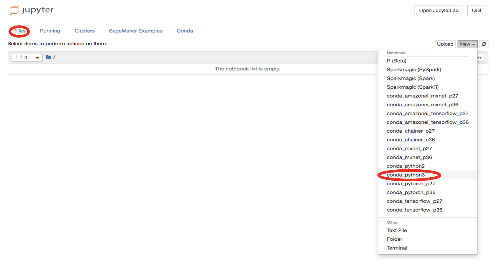
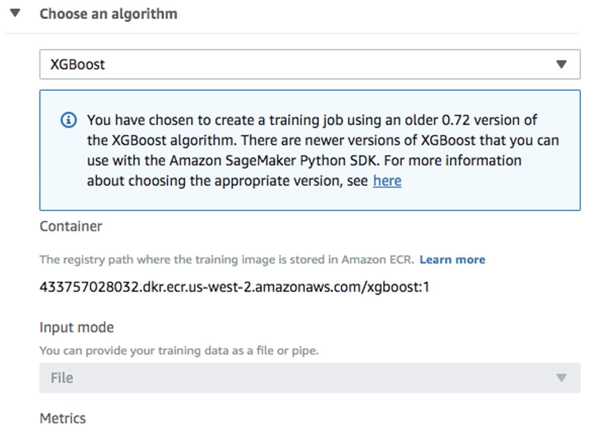

import CommunityLinkPartial from '../_partials/community_link.mdx';

# Use AWS SageMaker with Teradata Vantage


### Overview

This how-to will help you to integrate Amazon SageMaker with Teradata Vantage. The approach this guide explains is one of many potential approaches to integrate with the service.

Amazon SageMaker provides a fully managed Machine Learning Platform. There are two use cases for Amazon SageMaker and Teradata:

1.	Data resides on Teradata Vantage and Amazon SageMaker will be used for both the Model definition and subsequent scoring. Under this use case Teradata will provide data into the Amazon S3 environment so that Amazon SageMaker can consume training and test data sets for the purpose of model development. Teradata would further make data available via Amazon S3 for subsequent scoring by Amazon SageMaker. Under this model Teradata is a data repository only.

2.	Data resides on Teradata Vantage and Amazon SageMaker will be used for the Model definition, and Teradata for the subsequent scoring. Under this use case Teradata will provide data into the Amazon S3 environment so that Amazon SageMaker can consume training and test data sets for the purpose of model development. Teradata will need to import the Amazon SageMaker model into a Teradata table for subsequent scoring by Teradata Vantage. Under this model Teradata is a data repository and a scoring engine.

The first use case is discussed in this document.

Amazon SageMaker consumes training and test data from an Amazon S3 bucket. This article describes how you can load Teradata analytics data sets into an Amazon S3 bucket. The data can then available to Amazon SageMaker to build and train machine learning models and deploy them into a production environment.


### Prerequisites

import ClearscapeDocsNote from '../_partials/vantage_clearscape_analytics.mdx'

* Access to a Teradata Vantage instance.
  <ClearscapeDocsNote />
* IAM permission to access Amazon S3 bucket, and to use Amazon SageMaker service.
* An Amazon S3 bucket to store training data.

### Load data

Amazon SageMaker trains data from an Amazon S3 bucket. Following are the steps to load training data from Vantage to an Amazon S3 bucket:

1.	Go to Amazon SageMaker console and create a notebook instance. See [Amazon SageMaker Developer Guide](https://docs.aws.amazon.com/sagemaker/latest/dg/gs-setup-working-env.html) for instructions on how to create a notebook instance:

2.	Open your notebook instance:


3. Start a new file by clicking on `New -> conda_python3`:


4. Install Teradata Python library:

``` python
!pip install teradataml
```

5. In a new cell and import additional libraries:

``` python
import teradataml as tdml
from teradataml import create_context, get_context, remove_context
from teradataml.dataframe.dataframe import DataFrame
import pandas as pd
import boto3, os
```

6. In a new cell, connect to Teradata Vantage. Replace `<hostname>`, `<database user name>`, `<database password>` to match your Vantage environment:

``` python
create_context(host = '<hostname>', username = '<database user name>', password = '<database password>')
```

7. Retrieve data rom the table where the training dataset resides using TeradataML DataFrame API:

``` python
train_data = tdml.DataFrame('table_with_training_data')
trainDF = train_data.to_pandas()
```

8. Write data to a local file:

``` python
trainFileName = 'train.csv'
trainDF.to_csv(trainFileName, header=None, index=False)
```

9. Upload the file to Amazon S3:

``` python , id="sagemaker_first_usage", role="content-editable emits-gtm-events
bucket = 'sagedemo'
prefix = 'sagemaker/train'

trainFile = open(trainFileName, 'rb')
boto3.Session().resource('s3').Bucket(bucket).Object(os.path.join(prefix, localFile)).upload_fileobj(trainFile)
```

### Train the model

1. Select `Training jobs` on the left menu under `Training`, then click on `Create training job`:


2. At the `Create training job` window, fill in the `Job name` (e.g. `xgboost-bank`) and `Create a new role` for the IAM role. Choose `Any S3 bucket` for the Amazon S3 buckets and `Create role`:


3. Back in the `Create training job` window, use `XGBoost` as the algorithm:


4. Use the default `ml.m4.xlarge` instance type, and 30GB of additional storage volume per instance. This is a short training job, shouldn't take more than 10 minutes.


5. Fill in following hyperparameters and leave everything else as default:

```
num_round=100
silent=0
eta=0.2
gamma=4
max_depth=5
min_child_weight=6
subsample=0.8
objective='binary:logistic'
```

6. For `Input data configuration`, enter the Amazon S3 bucket where you stored your training data. Input mode is `File`. Content type is `csv`. `S3 location` is where the file uploaded to:


7. For `Output data configuration`, enter path where the output data will be stored:


8. Leave everything else as default, and click on “Create training job”. Detail instructions on how to configure the training job can be found in [Amazon SageMaker Developer Guide](https://docs.aws.amazon.com/sagemaker/latest/dg/sagemaker-mkt-algo-train.html#sagemaker-mkt-algo-train-console].

Once the training job's created, Amazon SageMaker launches the ML instances to train the model, and stores the resulting model artifacts and other output in the `Output data configuration` (`path/<training job name>/output` by default).

### Deploy the model

After you train your model, deploy it using a persistent endpoint

### Create a model

1. Select `Models` under `Inference` from the left panel, then `Create model`. Fill in the model name (e.g. `xgboost-bank`), and choose the IAM role you created from the previous step.
2.	For `Container definition 1`, use `433757028032.dkr.ecr.us-west-2.amazonaws.com/xgboost:latest` as `Location of inference code image`. `Location of model artifacts` is the output path of your training job

3. Leave everything else as default, then `Create model`.

### Create an endpoint configuration

1. Select the model you just created, then click on `Create endpoint configuration`:


2. Fill in the name (e.g. `xgboost-bank`) and use default for everything else. The model name and training job should be automatically populated for you. Click on `Create endpoint configuration`.

### Create endpoint

1. Select `Inference` -> `Models` from the left panel, select the model again, and click on `Create endpoint` this time:


2. Fill in the name (e.g. `xgboost-bank`), and select `Use an existing endpoint configuration`:


3. Select the endpoint configuration created from last step, and click on `Select endpoint configuration`:


4. Leave everything else as default and click on `Create endpoint`.

Now the model is deployed to the endpoint and can be used by client applications.

### Summary

This how-to demonstrated how to extract training data from Vantage and use it to train a model in Amazon SageMaker. The solution used a Jupyter notebook to extract data from Vantage and write it to an S3 bucket. A SageMaker training job read data from the S3 bucket and produced a model. The model was deployed to AWS as a service endpoint.

### Further reading
* [API integration guide for AWS SageMaker](https://docs.teradata.com/r/Enterprise_IntelliFlex_VMware/Teradata-VantageTM-API-Integration-Guide-for-Cloud-Machine-Learning/Amazon-Web-Services)
* [Integrate Teradata Jupyter extensions with SageMaker notebook instance](https://quickstarts.teradata.com/cloud-guides/integrate-teradata-jupyter-extensions-with-sagemaker.html)


<CommunityLinkPartial />

