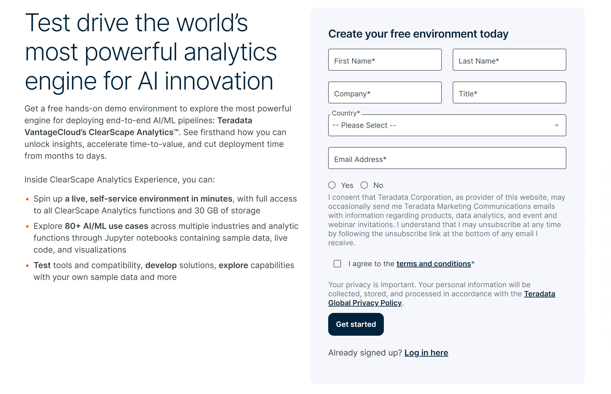
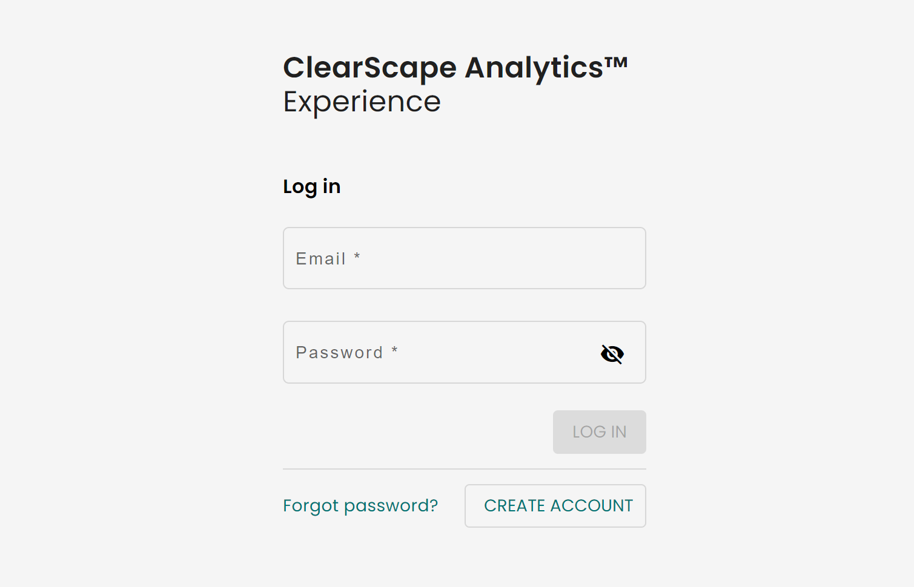
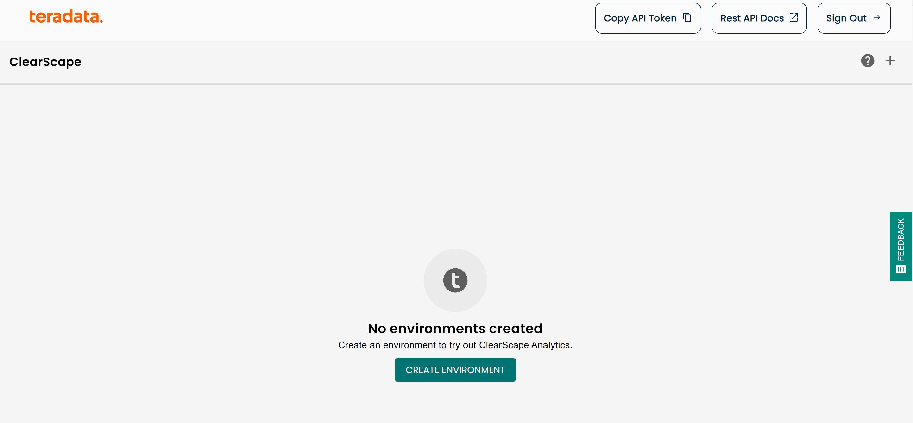

# Getting started with ClearScape Analytics Experience

## Overview

[ClearScape Analytics^TM^](https://www.teradata.com/platform/clearscape-analytics) is a powerful analytics engine in [Teradata VantageCloud](https://www.teradata.com/platform/vantagecloud). It delivers breakthrough performance, value, and growth across the enterprise with the most powerful, open and connected AI/ML capabilities on the market. You can experience ClearClearScape Analytics^TM^ and Teradata Vantage, in a non-production setting, through [ClearScape Analytics Experience](https://www.teradata.com/experience).

In this how-to we will go through the steps for creating an environment in ClearScape Analytics Experience and access demos.

  
## Create a ClearScape Analytics Experience account

Head over to [ClearScape Analytics Experience](https://www.teradata.com/experience) and create a free account.

Sign in to your [ClearScape Analytics account](https://clearscape.teradata.com/sign-in) to create an environment and access demos.

## Create an Environment

Once signed in, click on *CREATE ENVIRONMENT*

You will need to provide:

| Variable             | Value                                                                 |
|----------------------|-----------------------------------------------------------------------|
| **environment name** | A name for your environment, e.g. "demo"                              |
| **database password**| A password of your choice, this password will be assigned to `dbc` and `demo_user` users |
| **Region**           | Select a region from the dropdown                                     |

:::important
Note down the database password. You will need it to connect to the database.
:::

Click on *CREATE* button to complete the creation of your environment and now, you can see details of your environment.

## Access demos

The ClearScape Analytics Experience environment includes a variety of demos that showcase how to use analytics to solve business problems across many industries. 

To access demos, click on *RUN DEMOS USING JUPYTER* button. It will open a Jupyter environment in a new tab of your browser. 

:::note
You can find all the detail of demos on the demo index page.
:::

## Summary

In this quick start, we learned how to create an environment in ClearScape Analytics Experience and access demos.

## Further reading

* [ClearScape Analytics Experience API documentation](https://api.clearscape.teradata.com/api-docs/)
* [Teradata Documentation](https://docs.teradata.com/)

