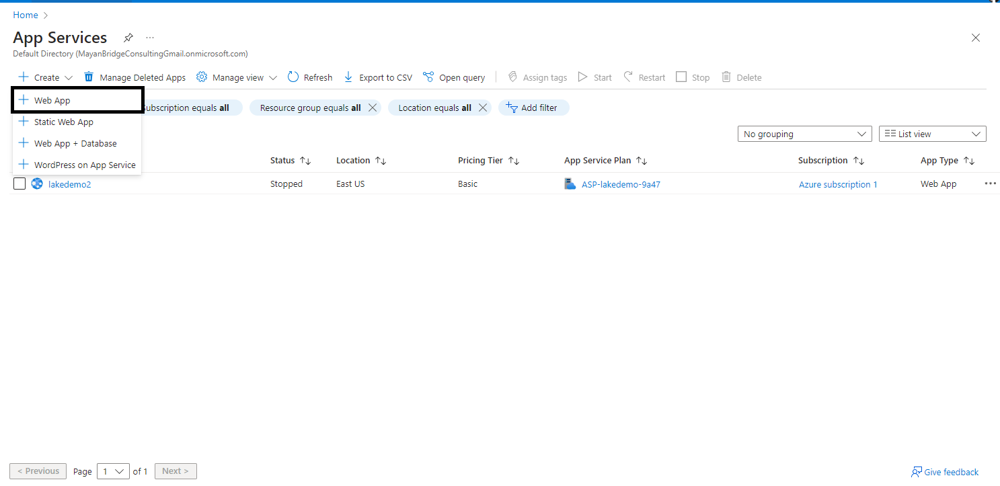
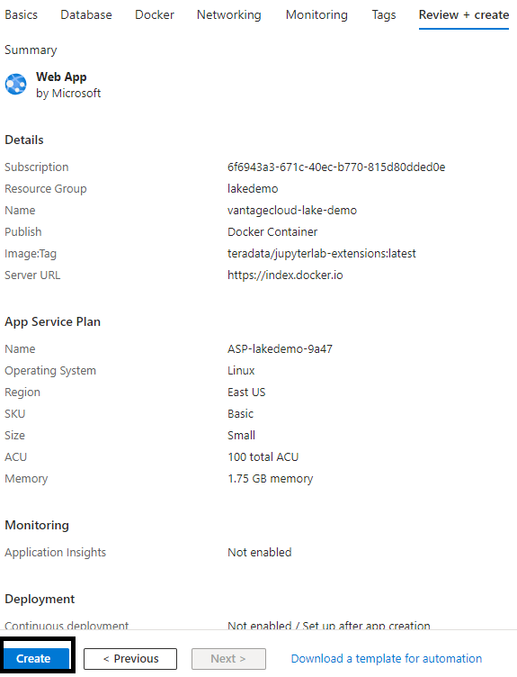
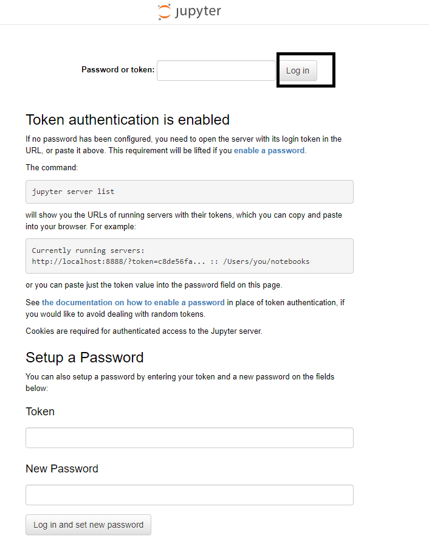

# Run Teradata Jupyter Notebook Demos for VantageCloud Lake in Microsoft Azure


## Overview
This quickstart details the process for running the [Teradata Jupyter Notebook Demos for VantageCloud Lake](https://github.com/Teradata/lake-demos), on Microsoft Azure.

## Prerequisites
* Access to a Microsoft Azure account
* Access to a VantageCloud Lake environment

import VantageCloudLakeRequest from './_partials/vantagecloud-lake-request.md';

<VantageCloudLakeRequest />

## Microsoft Azure setup
In this section we will cover in detail each of the steps below:

* Create a Microsoft Azure Web App based on Teradata Jupyter Lab extensions Docker image
* Configure Jupyter Lab extensions Azure Web App
* Load Vantagecloud Lake demos to Jupyter Lab extensions Azure Web App
* Find the IP of the Jupyter Lab extensions Azure Web App

### Create a Microsoft Azure Web App based on Teradata Jupyter Lab extensions Docker image
* Login to Microsoft Azure and click on "APP Services"


* In "App Services" click Web App



* On the "Basics" tab:
** Select the appropriate resource group from the dropdown, or create a new one
** Enter a name for your web app.
** Select "Docker Container" in the "Publish" radio button options
** Select "Linux" as the operating system
** Select the appropriate region from the dropdown
** Select the appropriate App Service plan. If you don't have one, a new one will be created with default configurations
:::tip
For purposes of the VantageCloud Lake demo redundancy is not needed
** After completing this tab, click the "Docker" tab to continue
:::


* On the "Docker" tab:
    * Select "Single Container" from the dropdown
    * In the "Image Source" dropdown select "Docker Hub"
    * In the "Access Type" dropdown select "Public"
    * In "Image and tag" type `teradata/jupyterlab-extensions:latest`
    :::tip
    A startup command is not needed for this App Service
       * Select the "Review + Create" tab to continue
    :::


* In the "Review + Create" tab click the "Create" button



* When the deployment is complete click the "Go to Resource" button


### Configure Jupyter Lab extensions Azure Web App
* Select Configuration on the right panel


* Add the following Application Settings


| **Application Setting** | **Value** |
|--------------|-----------|
| *"accept_license"*     | Y |
| *"WEBSITES_PORT"*  | 8888 |
| *"JUPYTER_TOKEN"*      | Define the Jupyter Lab access token that you would like to use. |

:::info
If you don't include the "JUPYTER_TOKEN" configuration, the container will generate a new token and log it to the console. You will need to retrieve it from the application logs. If you include the "JUPYTER_TOKEN" configuration key but leave the value blank, the system will set the token as an empty string, resulting in an unprotected Jupyter Lab environment without any token security.
:::

* Click on save, your app will be restarted


* Return to the Overview tab on the right panel

### Load Vantagecloud Lake demos to Jupyter Lab extensions Azure Web App
* Click on Default domain


* On the Jupyter Lab start dialogue enter the defined Jupyter token and click Log in



* On the Jupyter Lab console click on the git icon


* Copy the following URI in the corresponding field
** `https://github.com/Teradata/lake-demos.git`
* Click Clone


* On the Jupyter Lab console click in the `lake-demos` folder


### Find the IP of the Jupyter Lab extensions Azure Web App
* In JupyterLab open a notebook with Teradata Python kernel and run the following command to find your notebook instance's IP address.


``` python , id="lakedemos_azure_first_config", role="emits-gtm-events, content-editable"
import requests
def get_public_ip():
    try:
        response = requests.get('https://api.ipify.org')
        return response.text
    except requests.RequestException as e:
        return "Error: " + str(e)
my_public_ip = get_public_ip()
print("My Public IP is:", my_public_ip)
```

** The next step is whitelist this IP in your VantageCloud Lake environment to allow the connection
** This is for purposes of this guide and the notebook demos. For production environments, a more robust networking setting might be needed
** Azure App Service offers, as well, a list of all possible IP addresses that the service might expose. This is under the overview tab


## VantageCloud Lake Configuration
* In the VantageCloud Lake environment, under settings, add the IP of your notebook instance
:::tip
A lake environment supports multiple address whitelisting
:::


## Jupyter Notebook Demos for VantageCloud Lake

### Configurations
* [vars.json](https://github.com/Teradata/lake-demos/blob/main/vars.json) should be edited to match the configuration of your VantageCloud Lake environment 


* Especifically the following values should be added 


| **Variable** | **Value** |
|--------------|-----------|
| *"host"*     | Public IP value from your VantageCloud Lake environment |
| *"UES_URI"*  | Open Analytics from your VantageCloud Lake environment |
| *"dbc"*      | The master password of your VantageCloud Lake environment. |

* You'll see that in the sample vars.json, the passwords of all users are defaulted to "password", this is just for illustration purposes, you should change all of these password fields to strong passwords, secure them as necessary, and follow other password management best practices.

:::info
Remember to change all passwords in the vars.json file.
:::

## Run demos
Open and execute all the cells in *0_Demo_Environment_Setup.ipynb* to setup your environment. Followed by *1_Demo_Setup_Base_Data.ipynb* to load the base data required for demo.

To learn more about the demo notebooks, go to [Teradata Lake demos](https://github.com/Teradata/lake-demos) page on GitHub.

## Summary

In this quick start we learned how to run Jupyter notebook demos for VantageCloud Lake in Microsoft Azure.

## Further reading

* [Teradata VantageCloud Lake documentation](https://docs.teradata.com/r/Teradata-VantageCloud-Lake/Getting-Started-First-Sign-On-by-Organization-Admin)
* [Use Vantage from a Jupyter notebook](https://quickstarts.teradata.com/jupyter.html)